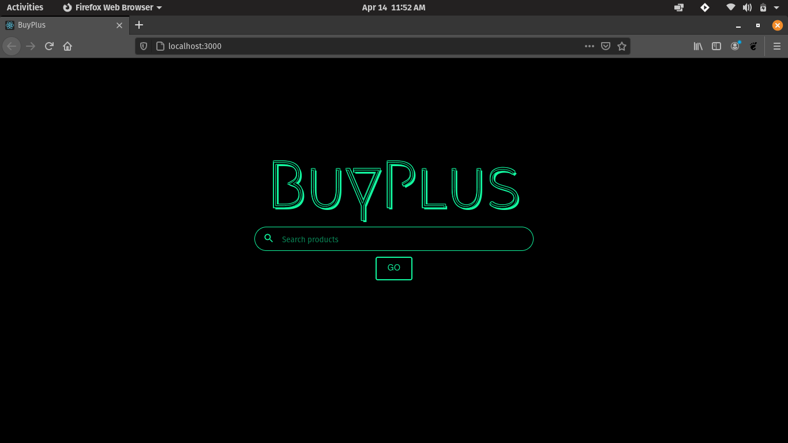

# BuyPlus

A web application for comparing product prices over various ecommerce websites

## Setup

1. Make sure you have installed Python3 and Node.js in your system

2. Download and extract or git clone this repository

3. Open up a terminal and run the following command to install required python libraries.

```python 
#for linux and macOs
pip3 install -r requirements.txt

#for windows users
pip install -r requirements.txt
```

3. Cd into frontend and install required node modules by running the following command.

```
npm install
```

## Usage

1. Cd into the api directory and run api.py
```python 
#for linux and macOs
python3 api.py

#for windows users
python api.py
```

2. Open another terminal in the frontend directory and run the following.
```
npm start
```

3. The web app will be up and running on [localhost:3000](https://127.0.0.1:3000/) , open a browser and visit the url.

Screenshots : 

<p align="center">
  
  
</p>

## Contributing
Pull requests are welcome. For major changes, please open an issue first to discuss what you would like to change.

Please make sure to update tests as appropriate.

## Happy open sourcing.
